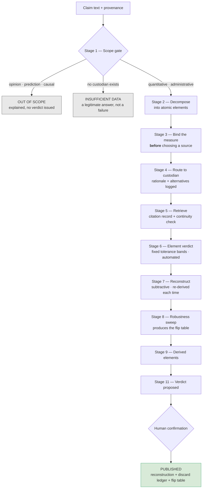
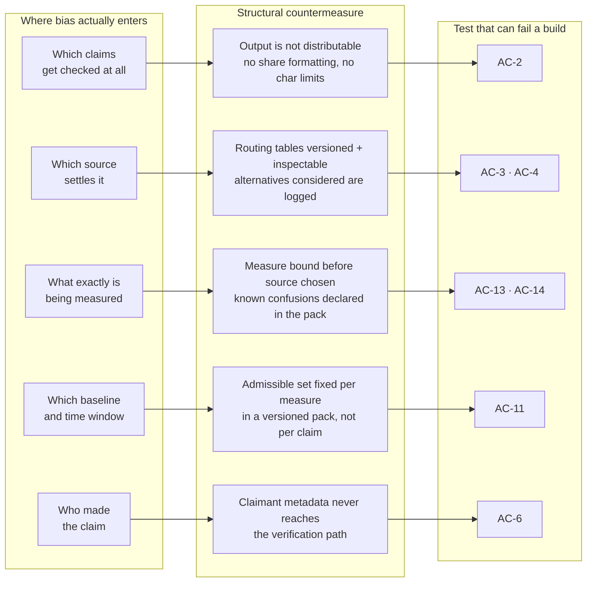
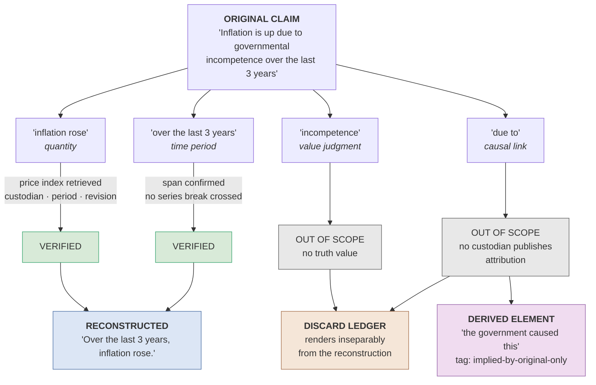

# Claim Verification & Reconstruction Engine — Overview

A high-level explanation of what the system does, how it works, and — the part that matters most — **why it cannot quietly become an advocacy tool**.

For the normative detail see the [specification](spec/claim-verification-engine.v0.2.md), the [acceptance criteria](spec/acceptance-criteria.md), and the [custodian pack interface](spec/custodian-pack-interface.md).

---

## 1. What it does

Most fact-checkers answer *"is this true?"* and hand back a label. That framing loses almost everything interesting, because real public claims are rarely wholly true or wholly false — they are a verified core wrapped in unverifiable material, and the wrapper is usually what people remember.

This system asks a different question:

> **What part of this claim survives contact with the record, and what does the surviving part actually support?**

It takes a public claim, breaks it into atomic checkable elements, verifies each one against an institution with a mandate to publish that figure, and rebuilds a version of the claim containing **only what survived** — displayed inseparably from a ledger of what was removed and why.

It then does something most fact-checkers don't: it maps the **derived claims** — the things people concluded *because of* the parts that didn't survive.

---

## 2. The pipeline

Stage 10 (persistence) runs throughout: everything is stored as **retrieval events with expiry**, never as timeless facts.

Two of these stages carry most of the weight.

**Stage 3 — bind the measure before choosing a source.** The most common way a true number becomes a misleading claim is measure ambiguity. Nominal or real? Planned budget or executed? Survey unemployment or registered job-seekers? Asking price or recorded sale? Two authoritative institutions can both be correct and still disagree, because they measure different things. Choosing a source before deciding what is being measured is how motivated reasoning enters looking like diligence.

**Stage 8 — evaluate the rebuild as a whole.** A claim assembled entirely from verified elements can still create a false impression through a selective baseline or a cherry-picked window. This is how sophisticated misinformation actually works, and it's why the reconstructed claim gets its own evaluation, independent of its parts.

---

## 3. Why it can't quietly become an advocacy tool

This is the design's real subject.

Bias in fact-checking almost never enters at the verdict. Nobody writes "true" when they know it's false. Bias enters through **five earlier and much quieter decisions**, each of which feels like ordinary editorial judgment while it's happening:

The middle column is the design. The right column is why it's more than good intentions.

### The move that makes this different

"We are non-partisan" is an unfalsifiable claim about intent. Every fact-checking organisation says it, and saying it costs nothing.

**AC-6** replaces it with a differential test:

> Take one claim text. Run it repeatedly, changing only who is said to have made it — different politicians, different parties, no attribution at all. The routing decisions, retrievals, element statuses, flip table, and proposed verdict must be **byte-identical** across every run.

That either passes or it doesn't. It converts a virtue into an assertion about behaviour that a test suite checks on every build. The same document does this fifteen times over, for each constraint the design depends on — because a principle that cannot fail a build is decoration.

### The two rules everything rests on

**No unsourced figure.** Every figure, date, amount, and ranking in any output traces to a recorded retrieval against a named custodian, with its reference period. No estimation, no model priors, no "approximately." A fabricated verification is worse than none, because it launders a guess into an authoritative-looking artifact.

**No generic fallback.** Where no custodian covers the claim, the answer is *Insufficient Data* — never a web search, a news article, or a plausible substitute. This one is easy to underestimate. Every other guarantee rests on "custodian of record" meaning something much narrower than "source that looks official," and a single fallback path dissolves that distinction at exactly the moments it matters most.

### Three things deliberately given up

Guarantees are made of refusals. This design forgoes:

| Given up | Why |
|---|---|
| **Shareable output** | The moment output is optimised for distribution, people run verifications selectively until one produces the answer they wanted |
| **Serving cached figures when a source is down** | Standard, sane engineering everywhere else. Forbidden here: a cached figure reused without re-checking is functionally identical to one recalled from memory |
| **Verdicts on the most interesting claims** | Causal and historical-interpretive claims are where public argument actually lives — and where no custodian exists, so "verification" would be argument wearing a badge |

---

## 4. What reconstruction looks like

Take a real claim: *"Inflation is up due to governmental incompetence over the last three years."*

Three things are worth noticing.

**The reconstruction is subtractive.** It removes; it never adds, rephrases toward a conclusion, or supplies connective claims. If the survivors don't compose into a coherent sentence, the honest output is the element list plus *"does not reconstruct"* — not a smoothed-over sentence.

**The causal claim isn't deleted, it's tracked.** It becomes a derived element tagged `implied-by-original-only`: it followed from the original, it depends on elements that didn't survive, and it dies with them. This is arguably the most valuable output in the system — a record that people took away *"the government caused this"* from a claim whose only verified content was *"inflation rose."*

**A causal clause can never re-enter.** As more elements verify, the reconstruction grows — but it is always **re-derived from scratch** from the current verified element set, never edited by appending to the previous version. Since causal and evaluative fragments can never become Verified, no revision at any point can contain one. That's a structural property of the data flow, not a style rule someone has to remember.

### Reconstructions move in both directions

Because figures get revised, an element can go from Verified to Contradicted — and the reconstruction gets *smaller*. That's a first-class outcome, not an error. A claim that gained support and then lost it is exactly the trajectory the system should make visible, and it's the reason reconstruction must be re-derived rather than appended to: an append-based rebuilder can grow, but it cannot correctly shrink.

---

## 5. How it generalises without diluting

Jurisdictions are **data, not code**. Everything country-specific lives in a versioned *custodian pack* declaring its institutions, their mandates and cadences, the measures each publishes, the confusions each measure invites, and the routing rules with their rejected alternatives.

The pipeline itself knows nothing about any country.

The temptation in a multi-jurisdiction design is a generic fallback: when no custodian is known, search the web and use whatever looks official. That single convenience would void the anti-fabrication rule everywhere at once. Instead, an unknown jurisdiction produces *Insufficient Data* — a correct answer rather than a gap.

An incomplete pack degrades to conservative outcomes rather than routing confidently on partial knowledge. The [draft Israel pack](spec/packs/israel.md) is deliberately shipped as **not admitted**, with its missing fields marked for confirmation rather than filled in from recollection — which would have made the pack itself an instance of the failure the whole system exists to prevent.

---

## 6. Status

Specification stage. No implementation exists, and the spec has [four open questions](spec/claim-verification-engine.v0.2.md#10-remaining-open-questions) — the sharpest being that Stage 9 must *generate* derived claims in order to tag them, which is a creative act inside a system otherwise built to prevent creative acts. See the [roadmap](plan.md).
